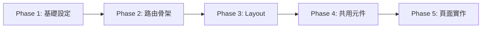

# Feature to UI 工作流程

根據 .feature 規格檔，使用 NuxtUI 產生完整的前端介面。

> **前置條件**：`/feature-to-api` 必須先執行完畢（types + mock API 已建立）。

## 定位（TDD 流程）

UI 是為了通過 E2E spec 而建。在 TDD 流程中，UI 在 spec 之後實作：

```
/feature-to-api → types + mock API
                      ↓
/test e2e spec  → .spec.ts（測試合約）
                      ↓
/feature-to-ui  → UI（為通過 spec 而建）  ← 你在這裡
                      ↓
/test e2e green → 修 UI 直到 spec 全過
```

## Workflow



## 使用方式

```bash
/feature-to-ui              # 從 Phase 1 開始
/feature-to-ui 1            # Phase 1: 基礎設定
/feature-to-ui 2            # Phase 2: 路由骨架
/feature-to-ui 3            # Phase 3: Layout 建置
/feature-to-ui 4            # Phase 4: 共用元件
/feature-to-ui 5 <功能名>   # Phase 5: 頁面實作（必須指定功能，一次一頁）
```

## 全量模式 vs Sync 模式

自動偵測當前狀態，決定執行模式：

| 條件 | 模式 | 說明 |
|------|------|------|
| `spec/report/route-map.yaml` **不存在** | 提示先執行 `/feature-to-api` | 前置條件未滿足 |
| 頁面 `.vue` 尚未建立 | **全量模式** | 從零建立所有 UI |
| 頁面 `.vue` 已存在 + `sync-report.md` 存在 | **Sync 模式** | 增量更新受影響的 UI |

### Sync 模式運作方式

1. 讀取 `spec/report/sync-report.md`（由 `/feature-to-api` Phase 0 產出）
2. 按標記執行：
   - Phase 2：只建立新增路由的空殼頁面
   - Phase 5：按 build（新增）/ patch（修改）/ rebuild（重大變更）分別處理

### Sync 模式注意事項

- sync 模式下 Phase **必須按順序執行**，不可跳過有「執行」建議的 Phase
- Phase 1/3/4 在 sync 模式下**通常可跳過**（除非 sync-report 指出需要）
- 刪除項目**不會自動執行**，需使用者手動處理

---

## 現有 Feature 檔案

!`ls -1 spec/gherkin-feature/*.dsl.feature 2>/dev/null || echo "(無)"`

---

## Phase 概覽

| Phase | 名稱 | 輸出 | 必讀規範 |
|-------|------|------|----------|
| 1 | 基礎設定 | app.config.ts, main.css, nuxt.config.ts（SEO head） | [phase-1](references/phase-1-theme.md) |
| 2 | 路由骨架 | 所有 pages/*.vue 空殼（含 testid） | [phase-2](references/phase-2-skeleton.md) + [rules.md `[P2]`](references/rules.md) |
| 3 | Layout 建置 | layouts/*.vue | [phase-3](references/phase-3-layout.md) + [rules.md `[P3]`](references/rules.md) |
| 4 | 共用元件 | components/common/*.vue（+ additionalFeature 元件） | [phase-4](references/phase-4-components.md) + [features.md](references/features.md)（若有） + [rules.md `[P4]`](references/rules.md) |
| 5 | 頁面實作 | 逐一填充 pages 內容 | [phase-5](references/phase-5-pages.md) + [page-builder.md](references/page-builder.md) + [rules.md `[P5]`](references/rules.md)（選讀：components.md、features.md） |

**設計理念**：骨架優先，細節後填。每個 Phase 只載入必要的規範，避免 context 過載。`app/types/api/` 作為 API 合約的單一真相來源（由 `/feature-to-api` 建立）。`route-map.yaml` 作為路由與 feature 對照的單一真相來源。**Phase 5 以 `.spec.ts` 為唯一 UI 合約**（testid 直接從 spec 的 `getByTestId()` 複製，不讀 `.flow.md` / `elements.md`）。

---

## 必讀文件

### 核心規範（按需讀取）

- **[rules.md](references/rules.md)** - 共用規則權威來源（配色、類型、API、Pinia、testid、Layout 規範）
- **references/phase-N-*.md** - 各 Phase 的執行步驟與模板（**每個 Phase 開始前讀取對應的 phase 檔**）
- [page-builder.md](references/page-builder.md) - DSL 解析 + 表單範本（Phase 5 需要）
- [components.md](references/components.md) - 元件使用規範（Phase 4, 5 需要）


### E2E 測試合約（Phase 2, 5 需要）

- `test/e2e/specs/*.spec.ts` - **Phase 5 的唯一 UI 合約**（testid、互動模式、斷言預期全在這裡）
- `spec/e2e-flows/pages/*.elements.md` - Phase 2 路由骨架的 testid 來源

> ⚠️ Phase 5 **直接從 `.spec.ts` 的 `getByTestId()` 複製 testid**，不讀 `.flow.md` / `elements.md`。
> 這確保 UI 的 testid 與測試合約完全一致，消除版本不同步的問題。

### 專案設定

@spec/ui-config/ui-config.yaml（完整規範）

### NuxtUI 文檔

執行 `/nuxt-ui` 載入官方文檔（Phase 3, 4, 5 需要）

---

## 快速指引

### Phase 1-2：基礎骨架

1. **Phase 1**：設定色彩主題 + SEO/Meta（app.config.ts + main.css + nuxt.config.ts）
2. **Phase 2**：建立所有頁面的空殼（只有 template 佔位）

### Phase 3-4：架構元件

3. **Phase 3**：建立 Layout（default.vue, auth.vue）
4. **Phase 4**：建立共用元件（ListContainer, ConfirmModal 等）

### Phase 5：功能實作

5. **Phase 5**：逐一實作每個頁面的完整功能（一次只做一個頁面，確認後才做下一個）

---

## 自動執行規則

- 執行 `/feature-to-ui`（無參數或參數為 `1`）時，**直接開始 Phase 1**
- **前置檢查**：確認 `spec/report/route-map.yaml` 和 `app/types/api/` 存在，若不存在則提示「請先執行 `/feature-to-api`」

---

## 注意事項

- **前置條件**：`/feature-to-api` 必須先完成（types + mock API + route-map.yaml 已存在）
- **Phase 5 額外前置條件**：`/test e2e spec` 必須先完成（`.spec.ts` 是 Phase 5 的唯一 UI 合約）
- **每個 Phase 完成後，告知用戶下一步應執行的指令**（如「下一步：`/feature-to-ui 5`」），不要用「要我繼續嗎？」的問法
- **Phase 5 一次只做一個頁面。每個頁面完成後輸出確認格式，然後立即停止回應，等待用戶回覆後才處理下一個頁面**
- **Phase 5 所有頁面處理完成後（不論 build/patch/rebuild），結尾必須提示：「下一步：`/test e2e green auto`」**
- **每個 Phase 開始時只讀取該 Phase 的 phase 檔 + rules.md**
- 禁止自行決定網站名稱、色彩等設定
- 所有設定從 `ui-config.yaml` 讀取
- Phase 5 禁止定義 local interface，必須 import `~/types/api/`
- Phase 5 每個功能必須先讀取 API 原始碼、共用元件、store
- **Phase 2 若 `spec/e2e-flows/pages/*.elements.md` 存在，testid 以該檔案為準**
- **Phase 5 testid 直接從 `test/e2e/specs/*.spec.ts` 的 `getByTestId()` 複製**，不讀 `.flow.md` / `elements.md`
