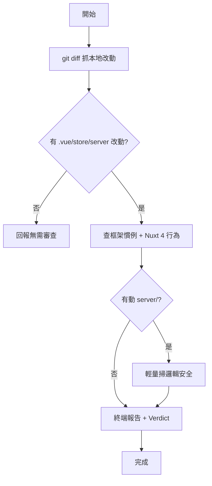

# SDD Review

對 git diff 做框架語意慣例與邏輯安全審查。**只查現有關卡抓不到的死角**,不重複它們的工作。

## 1. 邊界:只查現有關卡漏網的

本專案已有三道關卡,以下項目交給它們,本 skill **不查**:

| 已被覆蓋的項目 | 由誰負責 |
|----------------|----------|
| 語法、import 排序、格式、Options API、vue 風格規則 | `eslint`(@antfu + @nuxt) |
| 型別、幻覺 API、typed `$fetch` 路由、簽名不符 | `nuxi typecheck` |
| spec 合規、業務意圖、Business Invariants | `playwright` specs + `/vibe-check` |

本 skill 只補它們全部漏掉、且 AI 可驗證的兩類:**框架語意慣例**與**邏輯安全**。

## 2. 模式

| 模式 | 狀態 | 觸發 | 輸出 | 安全深度 |
|------|------|------|------|----------|
| local | 現行 | 手動 `/sdd-review` | 終端報告 | 輕量(動 `server/` 才點出可疑處) |
| pr | Phase 1 | GitHub Action(PR 事件) | PR 留言 | 完整(推敲 authz / 敏感資料) |

> 兩模式共用本 SKILL 的流程與 [checks.md](references/checks.md),差別只在安全深度與輸出。
> pr 模式入口:`.github/workflows/sdd-review.yml`(PR 對 `app/**`、`server/**` 改動時觸發)。
> Phase 1 只留言不自動改 code;自動修+push(僅框架慣例、安全永遠只留言)留待 Phase 2。
> 認證用 Claude 訂閱:本機跑 `claude setup-token`,把 token 存進 repo Secrets 的 `CLAUDE_CODE_OAUTH_TOKEN`(不另花 API 費用)。

## 3. 流程(local 模式)



### 步驟

1. 跑 `git diff`(working tree + staged),挑出 `app/**/*.vue`、`app/stores/**`、`server/**/*.ts`。無相關改動則回報「無需審查」並結束。
2. 對每個改動檔套用 6 項框架語意慣例 + Nuxt 4 行為檢查,判斷細節見 [checks.md](references/checks.md) 第 1、2 節。
3. 若 diff 動到 `server/`,加做輕量邏輯安全掃描(見 checks.md 安全段)。
4. 輸出終端報告(格式見第 4 節)。**懷疑某項時才** deep-read 對應的單一 antfu reference,不整包載入。

## 4. 報告格式

依嚴重度排序,固定結構:

```markdown
## SDD Review 報告
改動:<N> 檔

### 必修(違反框架慣例或本專案裁決)
- `app/stores/user.ts:12` — 解構 state 未用 storeToRefs,響應性會丟失
  依據:checks.md #3 / pinia core-stores

### 建議(效能 / 可讀性)
- `app/components/Foo.vue:8` — items 不需深層響應式,可改 shallowRef

### 通過
- 讀寫分離正確、store 解構皆用 storeToRefs

Verdict:可提交 / 需修正後再提交
```

無 finding 時只輸出「全部通過」。不為湊報告硬找問題。

## 5. 裁決(衝突時的優先序)

1. `CLAUDE.md` 與 `rules/` — 本專案 SSOT,最高
2. `skills/{vue,nuxt,pinia}/references/` — 框架正確性參考
3. 官方文檔 — 前兩者都不確定才查

> 已知裁決(不可誤報):
> - Pinia store 採 `@pinia/nuxt` 預設 auto-import,**不報「未手動 import store」為錯**
> - 本專案是 Nuxt 4,nuxt skill 為 3.x,目錄/設定差異不報為錯
