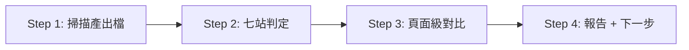

# SDD Status — 管線進度盤點

## 目的

**只做一件事**：唯讀掃描當前 worktree 的七站產出檔，推斷 SDD 管線走到哪一站，輸出狀態表與單一「建議下一步指令」。

**不做**：不建立、不修改任何檔案；不跑測試；不跨 worktree。

## 何時用

- 中斷換 session 接手，想知道這條線走到管線哪一站
- 多 worktree 並行開發，逐線盤點進度
- 跑任何 `/feature-to-*` 前，想確認前置產物齊不齊

## 使用方式

```bash
/sdd-status
```

無參數。

---

## 絕對唯讀（硬規則）

- 不建立、不修改、不刪除任何檔案——console 報告即唯一產出
- 不跑 playwright——green 判定只讀 `.last-run.json` 殘留檔，不主動觸發測試
- 只用相對路徑掃當前 worktree，不跨目錄、不讀其他 worktree
- **模板初始狀態產物全缺是常態**：各站顯示「未開始」即可，不得報錯、不得建議「修復」缺檔

---

## 流程



### Step 1：掃描（唯讀）

一次跑完所有存在性檢查（用 `find` 不用 shell glob——zsh 下 glob 沒命中會噴 no matches found；空輸出屬正常，不是錯誤）：

```bash
ls spec/api/api-spec.yml 2>/dev/null                      # OpenAPI 模式判定（影響貫通表 flow 欄）
find spec/gherkin-feature -name '*.feature' 2>/dev/null
find spec/e2e-flows -name '*.flow.md' 2>/dev/null
ls spec/report/route-map.yaml spec/report/sync-report.md 2>/dev/null
find app/types/api -name '*.ts' 2>/dev/null
find server/api server/mock -type f 2>/dev/null
find app/api -name '*.api.ts' 2>/dev/null
find test/e2e/specs -name '*.spec.ts' 2>/dev/null
cat test/e2e/test-results/.last-run.json 2>/dev/null
```

若 `spec/report/route-map.yaml` 存在，另讀其 `routes` 區塊（`path` + `page` + `features[].file` 欄位）供 Step 3 / 3.5 對比。另讀每個 feature flow.md 開頭的 `> 對應規格：…`（來源 feature 檔）與 `> 涵蓋頁面：…`（route）標頭，作為模組 → route-map 的結構化對應橋。

### Step 2：七站判定

| # | 站 | 判定依據 | 完成 | 部分 | 未開始 |
|---|-----|----------|------|------|--------|
| 1 | 規格置入 | `spec/gherkin-feature/*.feature`（含 `.dsl.feature`） | 有任一 | — | 無 |
| 2 | Flow | `spec/e2e-flows/*.flow.md` | 有 feature flow | 僅 `_common.flow.md` | 無 |
| 3 | API 合約 | `spec/report/route-map.yaml` ＋ `app/types/api/*.ts` | 兩者皆有 | 僅其一 | 皆無 |
| 4 | Mock/Server | `server/api/`、`server/mock/` 有檔 | 兩目錄皆有 | 僅一邊 | 皆無 |
| 5 | Client API | `app/api/*.api.ts` | 有 | — | 無 |
| 6 | 主 spec | `test/e2e/specs/*.spec.ts` | 有 | — | 無 |
| 7 | UI/Green | route-map `routes` vs `app/pages/` ＋ `.last-run.json` | 頁面全齊且 last-run passed | 頁面全齊但未跑／failed，或僅部分頁面存在 | route-map 缺，或無任何對應頁面 |

判定細則：

- **站 2**：`_common.flow.md` 是共用流程，不計 feature flow，存在時在依據欄單獨標示「含 _common.flow.md（共用流程）」
- **站 3**：`app/types/api/_schema.d.ts` 是模板自帶的 openapi-typescript 基建骨架，**不計為產物**；只計其他 `*.ts` 型別檔
- **站 7 green**：`test/e2e/test-results/.last-run.json` 是 Playwright 最近一次執行的殘留檔，`status` 為 passed/failed；**檔案不存在＝未跑過**。頁面未全齊時 green 僅供參考、不影響站別判定

### Step 3：頁面級對比（站 7 展開）

`route-map.yaml` 存在時才做：逐條取 `routes[].page` 檢查實檔是否存在，列「已實作／待實作」兩類。route-map 缺時站 7 依據標「無 route-map.yaml 可對比」，不列頁面表。

### Step 3.5：Feature 貫通度（橫向 per-module）

站級判定回答「整條線走到第幾站」；但**開發到一半 / 別人接手**更需要知道「**哪個模組做到哪、卡在哪站**」。站級用存在性（有檔就算完成）會把參差**抹平成「都完成」**——跑完一輪後追加的 feature 會被藏住。此步橫向逐模組對比，補上這個視角。

**選定模組清單（主鍵優先鏈，取第一個成立者——一律取「最上游可拆層」的完整集合，才看得到上游已有、下游未跟上的模組）**：

1. 有 feature flow（`spec/e2e-flows/*.flow.md`，排除 `_common.flow.md`）→ 以 flow 模組為清單，模組名取 slug（`{NN}-{module}` 的 `{module}`）。**最全**：能顯示「有 flow 但還沒 api / spec / ui」的模組。
2. 無 flow 但 **OpenAPI 模式**（`spec/api/api-spec.yml` 存在）→ 以 `route-map.yaml routes[]`（排除根路由 `/`）為清單；模組名取 `page` 目錄段或 route path 末段（該模式免 flow，route-map 是模組來源）。
3. 無 flow、非 OpenAPI、`spec/gherkin-feature/` 是**多個** `{NN}-*.feature` → 以各 feature 檔為清單。
4. gherkin 為**單一大檔**（多個 `Feature:` 塞一檔）且尚無 flow → **無法逐 feature 拆**：不列貫通表，改標「站 1 為單一大檔（N 個 Feature），尚未 /feature-to-flow 拆模組」，下一步回退站級判定。

> 為何不以 route-map 為主鍵：route-map 是 API 站產物，「剛置入 / 剛產 flow 但還沒跑 feature-to-api」的模組不在其中；用它當主鍵會漏掉正處於半途的模組——正是接手最該看到的。

**每個模組四格判定（走 route-map / flow 標頭的結構化對應，不猜檔名）**：

> ⚠️ **不要用模組 slug 去子字串比對 type / page 檔名。** 真實專案 `auth↔login/register`、`cakebox↔cake-box`、`rsvp-config↔rsvp/questions`、`thankyou-public` 共用 `thankyou.ts`——slug 對齊會把「其實有、只是名字不同」誤判成缺（**假半途**）。改用 flow.md 開頭的 `> 對應規格`（feature 清單）＋ `> 涵蓋頁面`，接到 route-map 的 `routes[].features[].file` 與 `page`。

| 格 | ✅ 依據 |
|----|---------|
| flow | 該 `{NN}-{slug}.flow.md` 存在（模組定義本身；OpenAPI 模式無 flow → 標 `—`，不計入「卡在」） |
| spec | `test/e2e/specs/{NN}-{slug}.spec.ts` 存在（與 flow 同 `NN-slug`，精確對齊） |
| api | 該模組有對應 client 包裝 `app/api/{slug}.api.ts`（feature-to-api 一資源一檔、命名穩定）。有 ✅／無（可能與他模組共用型別，如公開頁）標 `?` 不判缺。**api 屬整批產物（types/mock/client 一次產齊），精度低於 flow/spec/ui，卡點以後三者為準** |
| ui | flow 標頭「涵蓋頁面」的**每個 route** → `app/pages` 檔（`{route}.vue`，不存在再試 `{route}/index.vue`；動態段 `[x]` 原樣）都存在。全在 ✅／部分 🟡。無「涵蓋頁面」標頭才退回 route-map `routes[].page` |

**對不上的鐵律**：flow.md 缺標頭、feature 在 route-map 找不到、或 `route.page` 對不到 → 標 `? 需人工確認`，**絕不判為缺／半途**——「找不到同名」≠「不存在」，那正是假半途的根源。

「卡在」＝由左至右第一個非 ✅（`—`、`?` 不算缺）的格；四格全 ✅ ＝「全貫通」。此表**與站級表並存**，不取代——站級給整體概覽、貫通表給逐模組落點。

### Step 4：輸出報告

```
=== SDD Status ===

| # | 站 | 狀態 | 判定依據 |
|---|-----|------|----------|
| 1 | 規格置入 | ✅ 完成 | spec/gherkin-feature/ 有 4 個 .feature |
| 2 | Flow | ✅ 完成 | spec/e2e-flows/ 有 4 個 .flow.md（另含 _common.flow.md 共用流程） |
| 3 | API 合約 | ✅ 完成 | route-map.yaml + app/types/api/ 型別檔皆有 |
| 4 | Mock/Server | ✅ 完成 | server/api/、server/mock/ 皆有檔 |
| 5 | Client API | ✅ 完成 | app/api/ 有 *.api.ts |
| 6 | 主 spec | ✅ 完成 | test/e2e/specs/ 有 2 個 .spec.ts（站級只看存在性；per-module 落差見下方貫通表） |
| 7 | UI/Green | 🟡 部分 | 部分頁面存在；.last-run.json status=passed（頁面未全齊，僅供參考） |

頁面進度（route-map 存在時才列）：
| route | 頁面 | 狀態 |
|-------|------|------|
| /accounts | app/pages/accounts/index.vue | ✅ 已實作 |
| /sites | app/pages/sites/index.vue | ✅ 已實作 |
| /camera | app/pages/camera/index.vue | ⬜ 待實作 |

Feature 貫通度（主鍵：flow 模組）：
| 模組 | flow | api | spec | ui | 卡在 |
|------|------|-----|------|-----|------|
| accounts | ✅ | ✅ | ✅ | ✅ | 全貫通 |
| sites | ✅ | ✅ | ✅ | ✅ | 全貫通 |
| camera | ✅ | ✅ | ⬜ | ⬜ | 主 spec |
| report | ✅ | ⬜ | ⬜ | ⬜ | API 合約 |

⚠️ Sync 進行中（spec/report/sync-report.md 存在）

下一步：report 卡在「API 合約」→ `/feature-to-api`（Sync 補 report 型別與 route）
```

- `⚠️ Sync 進行中` 一行只在 `spec/report/sync-report.md` 存在時顯示，不展開內容
- 「下一步」**只輸出一行**，不列多個選項
- **Feature 貫通度表**：情況 1–3 列逐模組表；情況 4（單一大檔無 flow）改列一行說明，不列表

---

## 下一步決策表

**有 Feature 貫通表時（Step 3.5 情況 1–3）**：下一步取「**卡在最早站的模組**」，用下表的站別對應給指令（例：某模組卡在 API 合約 → `/feature-to-api`）。多個模組卡同一最早站時取編號最小者。

**無貫通表時（情況 4：單一大檔無 flow）**：退回站級——取**最早狀態非「完成」的站**，對應建議：

| 最早未完成站 | 建議下一步 |
|--------------|------------|
| 1 規格置入 | 下一步：置入 `.feature` 到 `spec/gherkin-feature/` 後跑 `/feature-to-flow` |
| 2 Flow | 下一步：`/feature-to-flow`（產出 .flow.md） |
| 3 API 合約 | 下一步：`/feature-to-api`（Phase 0 產出型別與 route-map） |
| 4 Mock/Server | 下一步：`/feature-to-api 1`（產出 mock data + server 端點） |
| 5 Client API | 下一步：`/feature-to-api 1.5`（產出 client 包裝層） |
| 6 主 spec | 下一步：`/test e2e`（偵測 E2E 狀態並產出執行計畫） |
| 7 頁面未齊 | 下一步：`/feature-to-ui`（為通過 spec 建 UI） |
| 7 頁面齊、green 未過或未跑 | 下一步：`/test e2e green auto`（修 UI 直到 spec 全過） |
| 七站全完成 | 下一步：有 vibe 改動先跑 `/vibe-check`，否則 `/commit` |

---

## 與相關 skill 的關係

```
/sdd-status     （這個 skill）唯讀盤點七站進度，指出下一站
   ↓ 依建議執行
/feature-to-flow → /feature-to-api → /test e2e → /feature-to-ui → /test e2e green
```

/sdd-status 不會自動呼叫任何下游指令，只報告與建議；產物的產生與修改由各站 skill 負責。
