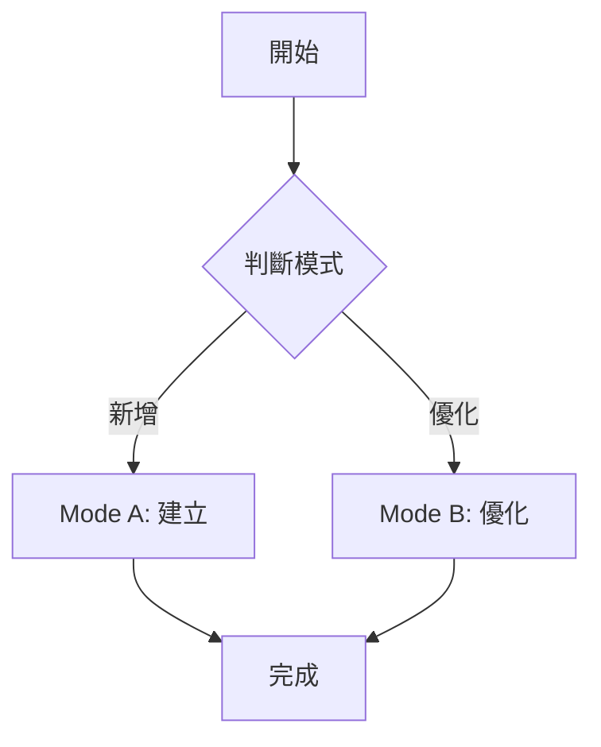

# Skill Creator

協助建立符合標準的 Skill，或優化現有 Skill。

<rules>
**執行規則（CRITICAL）**：

當看到 `<action>AskUserQuestion({...})</action>` 時：
1. **必須**使用 AskUserQuestion 工具，傳入函數參數
2. **禁止**將問題內容輸出為文字或 Markdown
3. **必須**等待用戶回答後，執行「回答後處理」邏輯
</rules>

## Workflow

## Mode Contract

| Mode | 詳細流程 | Input | Output | Checkpoint |
|------|----------|-------|--------|------------|
| Mode A | [mode-a.md](references/mode-a.md) | 用戶需求 | SKILL.md + references/ | 通過檢查清單 |
| Mode B | [mode-b.md](references/mode-b.md) | Skill 名稱 | 更新後的文件 | 通過檢查清單 |

---

## 流程控管

### 判斷模式

根據用戶意圖判斷：
- **新增**：用戶要建立新 Skill → Mode A
- **優化**：用戶要檢查/優化現有 Skill → Mode B

### Mode 完成後

更新 Skill 文件，回報完成狀態。

---

<rules>
**必須**（MUST）：
- 選項按可能性高至低排序
- 每個 Phase 結束時展示摘要並確認
- 確認類問題使用 AskUserQuestion

**禁止**（MUST NOT）：
- 不要跳過 Checkpoint
- 不要產出超過 500 行的 SKILL.md
</rules>

## 參考文件

| 文件 | 說明 |
|------|------|
| [official-spec.md](references/official-spec.md) | Claude Code 官方規格（含檢查規則）|
| [custom-spec.md](references/custom-spec.md) | 協作型 Skill 規格（含檢查規則）|
| [general-spec.md](references/general-spec.md) | 通用 Skill 規格（含檢查規則）|
| [templates.md](references/templates.md) | 五種類型模板 |
