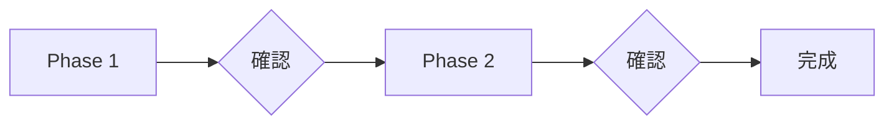

# 協作型 Skill 自訂規格

協作型 Skill 的結構設計與檢查規則。

---

## 1. 結構要素

| 要素 | 說明 |
|------|------|
| **Phase** | 階段，有明確的 Input/Output |
| **Checkpoint** | 階段結束時的用戶確認點 |
| **Step** | 階段內的執行步驟 |
| **Contract** | 定義 Input/Output/Checkpoint |

---

## 2. Step 類型

| 類型 | 標記 | 實現方式 |
|------|------|----------|
| 單選 | `[單選]` | AskUserQuestion（multiSelect: false）|
| 多選 | `[多選]` | AskUserQuestion（multiSelect: true）|
| 確認 | `[確認]` | 展示摘要 + AskUserQuestion |
| 開放式 | 開放式 | Markdown 引導 |
| 處理 | 處理 | AI 自動執行 |

### AskUserQuestion 格式

```markdown
<action>
AskUserQuestion({
  question: "問題內容？",
  header: "標題",
  options: [
    { label: "選項 1", description: "說明" },
    { label: "選項 2", description: "說明" }
  ],
  multiSelect: false
})
</action>
```

### 檢查規則

| # | 項目 | 通過條件 | 嚴重度 |
|---|------|----------|--------|
| 1.1 | Step 類型標記 | 有 `[單選]`/`[多選]`/`[確認]`/開放式/處理 | Critical |
| 1.2 | AskUserQuestion 格式 | 互動 Step 用 `<action>AskUserQuestion` | Critical |
| 1.3 | 選項數量 | ≤4 個選項 | Critical |
| 1.4 | header 長度 | ≤12 字元 | Warning |
| 1.5 | 回答後處理 | 每個 AskUserQuestion 後有處理邏輯 | Critical |

---

## 3. 執行規則

協作型 Skill 必須在 SKILL.md 開頭加入：

```markdown
<rules>
**執行規則（CRITICAL）**：

當看到 `<action>AskUserQuestion({...})</action>` 時：
1. **必須**使用 AskUserQuestion 工具，傳入函數參數
2. **禁止**將問題內容輸出為文字或 Markdown
3. **必須**等待用戶回答後，執行「回答後處理」邏輯
</rules>
```

### 檢查規則

| # | 項目 | 通過條件 | 嚴重度 |
|---|------|----------|--------|
| 2.1 | CRITICAL 執行規則 | SKILL.md 開頭有 `<rules>` 區塊 | Critical |

---

## 4. 流程圖

使用 Mermaid 繪製，每個 Phase 後必須有 Checkpoint：



### 檢查規則

| # | 項目 | 通過條件 | 嚴重度 |
|---|------|----------|--------|
| 3.1 | Mermaid 流程圖 | 有 `flowchart` 或 `graph` | Warning |
| 3.2 | Checkpoint 節點 | 每個 Phase 後有確認節點 | Critical |

---

## 5. Phase 文件結構

每個 `phase-*.md` 必須包含以下兩個區塊：

### 必要區塊

| 區塊 | 標題 | 位置 | 說明 |
|------|------|------|------|
| **Contract** | `## Contract` | 文件開頭 | 定義 Input/Output/Checkpoint |
| **Workflow** | `## Workflow` | Contract 之後 | Mermaid 流程圖 |

### Phase 文件範本

```markdown
# Phase N: {名稱}

{簡述}

## Contract

\`\`\`yaml
input:
  source: user | phase-{n} | context | API
  type: table | list | json | text
  required: [欄位列表]

output:
  type: table | list | json | text
  schema: {結構定義}

checkpoint: 用戶確認條件
\`\`\`

## Workflow

\`\`\`mermaid
flowchart TD
    S1[Step 1] --> S2[Step 2]
    S2 --> S3{Step 3: 確認}
    S3 -->|確認| DONE[完成]
    S3 -->|調整| S2
\`\`\`

---

## Step 1: {步驟名稱}（處理）

...
```

### SKILL.md Contract 表格

```markdown
| Phase | 詳細流程 | Input | Output | Checkpoint |
|-------|----------|-------|--------|------------|
| Phase 1 | [phase-1-xxx.md](references/phase-1-xxx.md) | 用戶需求 | 定位結果 | 確認定位 |
```

### 檢查規則

| # | 項目 | 通過條件 | 嚴重度 |
|---|------|----------|--------|
| 4.1 | SKILL.md Contract 表格 | 有 Phase/Mode Contract 表格 | Critical |
| 4.2 | Phase Contract 存在 | 每個 phase-*.md 有 `## Contract` 區塊 | Critical |
| 4.3 | Phase Workflow | 每個 phase-*.md 有 `## Workflow` + Mermaid 流程圖 | Critical |
| 4.4 | Input 欄位 | Contract 有 `source`、`type`、`required` | Warning |
| 4.5 | Output 欄位 | Contract 有 `type`、`schema` | Warning |

---

## 6. 解耦原則

| 原則 | 說明 |
|------|------|
| **單一職責** | 每個 Phase 只做一件事 |
| **明確邊界** | Input/Output 完整定義，無隱式依賴 |
| **可替換性** | 任意 Phase 可獨立替換 |

### 檢查規則

| # | 項目 | 通過條件 | 嚴重度 |
|---|------|----------|--------|
| 5.1 | 無跨 Phase 引用 | Phase 文件不引用其他 `phase-*.md` | Warning |
| 5.2 | 無流程決策 | Phase 內不決定「下一步做什麼」| Warning |
| 5.3 | 編號連續 | Phase 1, 2, 3... 無跳號 | Critical |
| 5.4 | 檔名一致 | `phase-{n}-*.md` 與內容編號一致 | Critical |

---

## 7. 回答後處理

用戶回答後的標準處理流程：

| 選擇類型 | 動作 |
|----------|------|
| 預設選項 | 記錄選擇 → 下一步 |
| Other（新增內容）| 加入選項 → 下一步 |
| Other（修改請求）| 調整 → 重新提問 |
| Other（跳過）| 標記跳過 → 下一步 |

