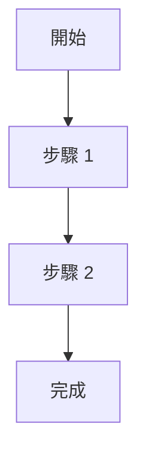

# 通用 Skill 規格

所有 Skill 適用的通用規範。

---

## 1. Workflow圖

每個 Skill 的 SKILL.md 必須包含 Mermaid 流程圖，明確表示Workflow。

### 格式



### 規則

- 使用 `flowchart TD`（上到下）或 `flowchart LR`（左到右）
- 節點命名要有意義
- 分支用菱形 `{}`，一般步驟用方括號 `[]`

### 檢查規則

| # | 項目 | 通過條件 | 嚴重度 |
|---|------|----------|--------|
| 1.1 | Mermaid 流程圖 | SKILL.md 有 `flowchart` 或 `graph` | Critical |

---

## 2. 統一編號規範

文件內的編號必須統一且連續。

### 編號層級定義

| 層級 | 用途 | 格式 | 範例 | 適用場景 |
|------|------|------|------|----------|
| **章節** | 組織規範文件結構 | `## N. 標題` | `## 1. Frontmatter` | spec 文件、參考文件 |
| **Mode** | 區分執行模式 | `Mode A/B/C` | `Mode A: 建立` | 多模式 Skill |
| **Phase** | 執行階段（有 Checkpoint）| `Phase N` | `Phase 1: 定位` | 協作型 Skill |
| **Step** | Phase 內的執行步驟 | `Step N` | `Step 1: 收集資訊` | Phase 文件內 |
| **檢查項目** | 檢查規則編號 | `N.M` | `1.1`, `2.3` | 檢查規則表格 |

### 層級關係

```
SKILL.md
├── Mode A
│   ├── Phase 1
│   │   ├── Step 1
│   │   ├── Step 2
│   │   └── Checkpoint
│   └── Phase 2
│       ├── Step 1
│       └── Checkpoint
└── Mode B
    └── ...
```

### 編號原則

1. **從 1 開始**：所有數字編號從 1 開始（Phase 1, Step 1, 1.1）
2. **連續無跳號**：1, 2, 3... 不可跳號（如 1, 3, 4）
3. **檔名對應**：`phase-1-xxx.md` 內容必須是 Phase 1
4. **獨立編號空間**：
   - 每個文件的章節編號獨立（都從 1 開始）
   - 每個 Phase 的 Step 編號獨立（都從 1 開始）
   - 每個檢查規則表格的編號獨立（都從 1.1 開始）

### 檢查規則

| # | 項目 | 通過條件 | 嚴重度 |
|---|------|----------|--------|
| 2.1 | 編號從 1 開始 | 無從 0 開始的編號 | Critical |
| 2.2 | 編號連續 | 無跳號（如 1, 3, 4）| Critical |
| 2.3 | 檔名編號一致 | `phase-{n}-*.md` 與內容 Phase N 一致 | Critical |

---

## 3. References 文件結構

references/ 目錄的組織規範。

### 目錄結構

```
references/
├── phase-{n}-{name}.md    # Phase 詳細流程（協作型）
├── mode-{x}.md            # Mode 詳細流程（多模式）
├── {topic}-spec.md        # 規格定義文件
├── {topic}.md             # 一般參考文件
└── examples/              # 範例（若需要）
    └── *.md
```

### 檔名規範

| 類型 | 格式 | 範例 |
|------|------|------|
| Phase 文件 | `phase-{n}-{動詞}.md` | `phase-1-collect.md` |
| Mode 文件 | `mode-{letter}.md` | `mode-a.md` |
| 規格文件 | `{主題}-spec.md` | `api-spec.md` |
| 一般文件 | `{主題}.md` | `templates.md` |

### 檔案大小

- 單一文件 ≤500 行
- 超過則拆分為多個文件

### 連結格式

```markdown
# 從 SKILL.md 連結
[phase-1-collect.md](references/phase-1-collect.md)

# 從 references/ 內連結同層文件
[templates.md](templates.md)

# 錨點連結
[檢查規則](official-spec.md#檢查規則)
```

### 檢查規則

| # | 項目 | 通過條件 | 嚴重度 |
|---|------|----------|--------|
| 3.1 | 檔名格式 | 符合命名規範（小寫+連字號）| Critical |
| 3.2 | 檔案大小 | 單一文件 ≤500 行 | Warning |
| 3.3 | 連結有效 | 所有內部連結指向存在的文件 | Critical |
| 3.4 | 相對路徑 | 使用相對路徑，非絕對路徑 | Warning |

---

## 4. Markdown 一致性

Skill 文件的 Markdown 格式規範。

### 標題層級

| 層級 | 用途 | 範例 |
|------|------|------|
| `#` | 文件標題（僅一個）| `# Skill Creator` |
| `##` | 主要章節 | `## 1. Frontmatter` |
| `###` | 子章節 | `### 檢查規則` |
| `####` | 細項（少用）| `#### 特殊情況` |

### 表格格式

```markdown
| 欄位 | 說明 |
|------|------|
| 內容 | 內容 |
```

- 使用 `|------|` 分隔線
- 欄位對齊（左對齊預設）

### 程式碼區塊

```markdown
# 指定語言
\`\`\`yaml
key: value
\`\`\`

# Mermaid 流程圖
\`\`\`mermaid
flowchart TD
    A --> B
\`\`\`
```

### 列表格式

```markdown
# 無序列表
- 項目 1
- 項目 2

# 有序列表
1. 步驟 1
2. 步驟 2

# 巢狀列表（縮排 2 或 4 空格）
- 父項目
  - 子項目
```

### 強調格式

| 格式 | 用途 | 範例 |
|------|------|------|
| `**粗體**` | 重要術語、關鍵字 | **必須** |
| `` `行內程式碼` `` | 檔名、指令、變數 | `SKILL.md` |
| `> 引用` | 引用說明、備註 | > 注意事項 |

### 檢查規則

| # | 項目 | 通過條件 | 嚴重度 |
|---|------|----------|--------|
| 4.1 | 單一 H1 | 文件只有一個 `#` 標題 | Critical |
| 4.2 | 標題層級連續 | 無跳級（如 `##` 直接到 `####`）| Warning |
| 4.3 | 表格分隔線 | 表格有 `|---|` 分隔線 | Critical |
| 4.4 | 程式碼語言標記 | 程式碼區塊有語言標記 | Warning |
