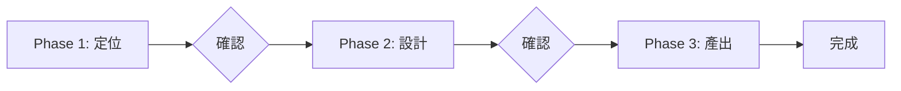

# Mode A: 建立新 Skill

從零開始建立符合標準的 Skill。

## Contract

```yaml
input:
  source: user
  type: text
  required: [用戶需求描述]

output:
  type: files
  schema: SKILL.md + references/*.md

checkpoint: 通過檢查清單
```

## Workflow



## Phase Contract 總覽

| Phase | 詳細流程 | Input | Output | Checkpoint |
|-------|----------|-------|--------|------------|
| Phase 1 | [phase-a1-positioning.md](phase-a1-positioning.md) | 用戶需求 | 名稱、類型、觸發條件 | 用戶確認定位 |
| Phase 2 | [phase-a2-design.md](phase-a2-design.md) | Skill 定位 | Phase/Step 設計 | 用戶確認設計 |
| Phase 3 | [phase-a3-output.md](phase-a3-output.md) | 完整設計 | SKILL.md + references/ | 通過檢查清單 |

---

## 流程控管

### Phase 1 完成後

讀取定位資訊，進入 Phase 2。

### Phase 2 完成後

讀取設計，進入 Phase 3。

### Phase 3 完成後

Mode A 完成，回報結果。

---

## 產出結構

```
.claude/skills/{skill-name}/
├── SKILL.md                    # 主檔案（≤500 行）
└── references/                 # 參考資料
    └── phase-N-xxx.md          # Phase 執行細節
```
