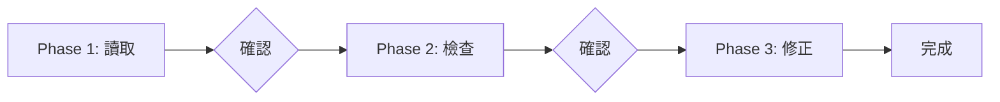

# Mode B: 優化現有 Skill

檢查並優化現有 Skill，確保符合標準。

## Contract

```yaml
input:
  source: user
  type: text
  required: [Skill 名稱]

output:
  type: files
  schema: 更新後的 SKILL.md + references/*.md

checkpoint: 通過檢查清單
```

## Workflow



## Phase Contract 總覽

| Phase | 詳細流程 | Input | Output | Checkpoint |
|-------|----------|-------|--------|------------|
| Phase 1 | [phase-b1-read.md](phase-b1-read.md) | Skill 名稱 | 內容摘要 | 用戶確認目標 |
| Phase 2 | [phase-b2-check.md](phase-b2-check.md) | Skill 內容 | 問題清單 | 用戶確認問題 |
| Phase 3 | [phase-b3-fix.md](phase-b3-fix.md) | 問題清單 | 更新後的文件 | 通過檢查清單 |

---

## 流程控管

### Phase 1 完成後

讀取完成，進入 Phase 2 檢查。

### Phase 2 完成後

檢查完成，進入 Phase 3 修正。

### Phase 3 完成後

Mode B 完成，回報結果。
