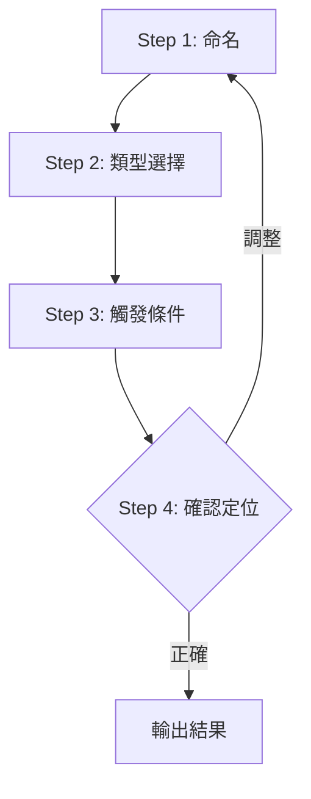

# Phase 1: 定位

確定 Skill 的基本定位。

## Contract

```yaml
input:
  source: user
  type: text
  required: [用戶需求描述]

output:
  type: table
  schema:
    - name: Skill 名稱
    - type: Skill 類型
    - triggers: 觸發條件

checkpoint: 用戶確認定位
```

## Workflow



---

## Step 1: 命名 `[單選]`

根據用戶需求，提供命名建議：

<action>
AskUserQuestion({
  question: "Skill 要叫什麼名稱？",
  header: "命名",
  options: [
    { label: "{建議名稱-1}", description: "根據需求推導" },
    { label: "{建議名稱-2}", description: "根據需求推導" },
    { label: "{建議名稱-3}", description: "根據需求推導" }
  ],
  multiSelect: false
})
</action>

---

## Step 2: 類型選擇 `[單選]`

<action>
AskUserQuestion({
  question: "這個 Skill 屬於哪種類型？",
  header: "類型",
  options: [
    { label: "協作型", description: "多步驟互動流程" },
    { label: "快捷型", description: "單一命令快速執行" },
    { label: "參考型", description: "提供知識或規範" },
    { label: "自動型", description: "自動觸發執行" }
  ],
  multiSelect: false
})
</action>

---

## Step 3: 觸發條件（開放式）

請描述這個 Skill 的觸發場景：
- 用戶會說什麼話來觸發？
- 有哪些關鍵字？
- 什麼情境下需要這個 Skill？

---

## Step 4: 確認定位 `[確認]`

```markdown
## Skill 定位摘要

| 項目 | 值 |
|------|-----|
| 名稱 | {name} |
| 類型 | {type} |
| 觸發條件 | {triggers} |

### Description 草稿
Use when {觸發場景描述}。關鍵字：{keyword1}、{keyword2}。
```

<action>
AskUserQuestion({
  question: "定位是否正確？",
  header: "定位確認",
  options: [
    { label: "正確，進入設計", description: "進入 Phase 2" },
    { label: "調整名稱", description: "重新命名" },
    { label: "調整類型", description: "重新選擇類型" }
  ],
  multiSelect: false
})
</action>

### 回答後處理

| 選擇 | 處理 |
|------|------|
| 正確，進入設計 | 記錄定位 → 輸出結果 |
| 調整名稱 | 回到 Step 1 |
| 調整類型 | 回到 Step 2 |
| Other（新內容）| 更新定位 → 重新確認 |

---

## Output

```yaml
positioning:
  name: "{skill-name}"
  type: "{協作型|快捷型|參考型|自動型}"
  triggers:
    keywords: ["{keyword1}", "{keyword2}"]
    scenarios: ["{scenario1}", "{scenario2}"]
  description: "Use when {description}"
```
