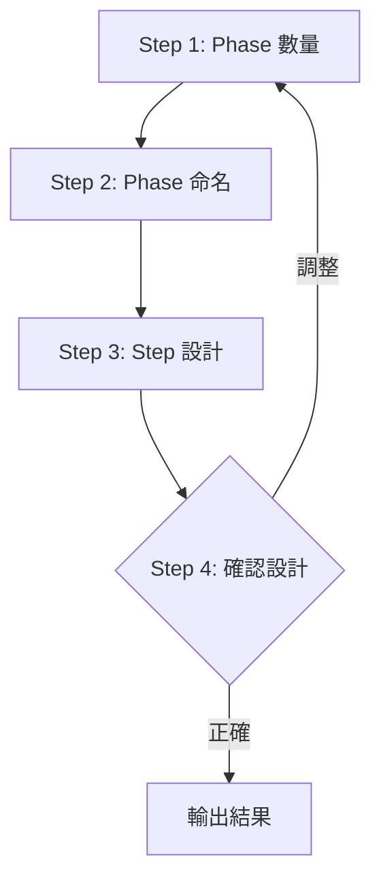

# Phase 2: 設計

設計 Skill 的 Phase 與 Step 結構。

## Contract

```yaml
input:
  source: phase-1
  type: yaml
  required: [name, type, triggers]

output:
  type: yaml
  schema:
    - phases: Phase 清單
    - steps: 每個 Phase 的 Step

checkpoint: 用戶確認設計
```

## Workflow



---

## Step 1: Phase 數量 `[單選]`

<action>
AskUserQuestion({
  question: "這個 Skill 需要幾個 Phase？",
  header: "Phase 數量",
  options: [
    { label: "2 個 Phase", description: "簡單流程" },
    { label: "3 個 Phase", description: "標準流程" },
    { label: "4 個 Phase", description: "複雜流程" }
  ],
  multiSelect: false
})
</action>

---

## Step 2: Phase 命名（開放式）

為每個 Phase 命名並定義職責：

```markdown
| Phase | 名稱 | 職責 |
|-------|------|------|
| Phase 1 | {名稱} | {職責} |
| Phase 2 | {名稱} | {職責} |
| Phase N | {名稱} | {職責} |
```

---

## Step 3: Step 設計（處理）

根據 Phase 定義，設計每個 Phase 的 Steps：

**Step 類型參考**：
| 類型 | 使用場景 |
|------|----------|
| `[單選]` | 需要用戶從選項中選一個 |
| `[多選]` | 需要用戶選多個選項 |
| `[確認]` | 展示摘要請用戶確認 |
| 開放式 | 需要用戶自由輸入 |
| 處理 | AI 自動執行 |

---

## Step 4: 確認設計 `[確認]`

```markdown
## Skill 設計摘要

### Phase 結構
| Phase | 名稱 | Steps | Checkpoint |
|-------|------|-------|------------|
| 1 | {name} | {n} 個 | {checkpoint} |
| 2 | {name} | {n} 個 | {checkpoint} |

### Step 清單
#### Phase 1: {name}
- Step 1: {step} `[類型]`
- Step 2: {step} `[類型]`

#### Phase 2: {name}
- Step 1: {step} `[類型]`
- Step 2: {step} `[類型]`
```

<action>
AskUserQuestion({
  question: "設計是否正確？",
  header: "設計確認",
  options: [
    { label: "正確，開始產出", description: "進入 Phase 3" },
    { label: "調整 Phase", description: "重新設計 Phase" },
    { label: "調整 Steps", description: "重新設計 Steps" }
  ],
  multiSelect: false
})
</action>

### 回答後處理

| 選擇 | 處理 |
|------|------|
| 正確，開始產出 | 記錄設計 → 輸出結果 |
| 調整 Phase | 回到 Step 1 |
| 調整 Steps | 回到 Step 3 |
| Other（新內容）| 更新設計 → 重新確認 |

---

## Output

```yaml
design:
  phases:
    - name: "{phase-1-name}"
      checkpoint: "{checkpoint}"
      steps:
        - name: "{step-name}"
          type: "{單選|多選|確認|開放式|處理}"
        - name: "{step-name}"
          type: "{type}"
    - name: "{phase-2-name}"
      checkpoint: "{checkpoint}"
      steps:
        - name: "{step-name}"
          type: "{type}"
```
