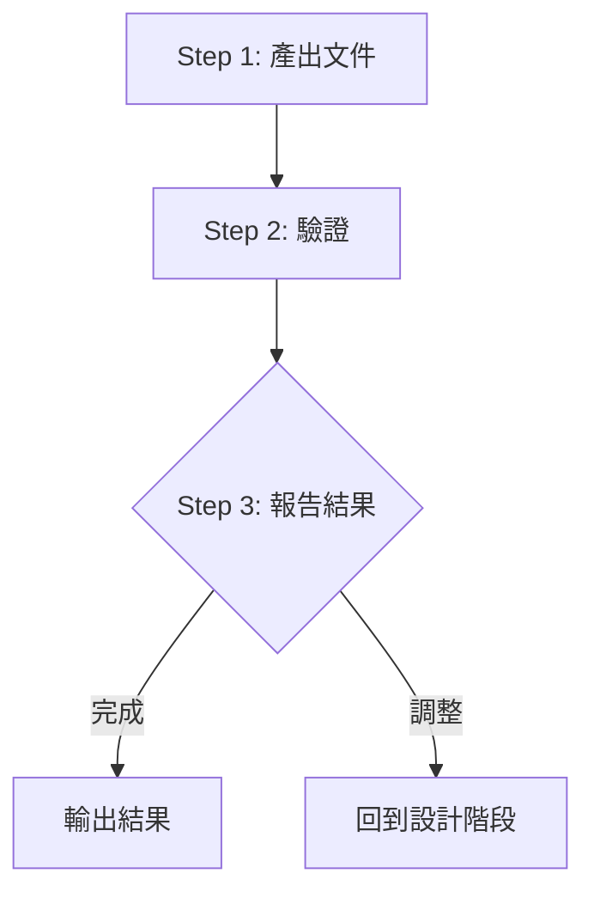

# Phase 3: 產出

根據設計產出 Skill 文件。

## Contract

```yaml
input:
  source: phase-2
  type: yaml
  required: [positioning, design]

output:
  type: files
  schema: SKILL.md + references/*.md

checkpoint: 通過檢查清單
```

## Workflow



---

## Step 1: 產出文件（處理）

根據設計產出以下文件：

```
.claude/skills/{skill-name}/
├── SKILL.md                    # 主檔案（≤500 行）
└── references/                 # 參考資料
    └── phase-N-xxx.md          # Phase 執行細節
```

### SKILL.md 結構

```markdown
---
name: {skill-name}
description: |
  {description}. Use when {triggers}.
disable-model-invocation: true  # 協作型必須
---

# {Skill Name}

{簡短描述}

<rules>
**執行規則（CRITICAL）**：

當看到 `<action>AskUserQuestion({...})</action>` 時：
1. **必須**使用 AskUserQuestion 工具，傳入函數參數
2. **禁止**將問題內容輸出為文字或 Markdown
3. **必須**等待用戶回答後，執行「回答後處理」邏輯
</rules>

## Workflow

{Mermaid 流程圖}

## Phase Contract 總覽

| Phase | 詳細流程 | Input | Output | Checkpoint |
|-------|----------|-------|--------|------------|
| Phase 1 | [phase-1-xxx.md](references/phase-1-xxx.md) | {input} | {output} | {checkpoint} |

## 流程控管

{Phase 完成後的處理邏輯}
```

---

## Step 2: 驗證（處理）

根據檢查清單驗證：

**結構檢查**：
- [ ] SKILL.md ≤ 500 行
- [ ] 有 frontmatter（name, description）
- [ ] 協作型設定 `disable-model-invocation: true`

**流程檢查**：
- [ ] 有 Mermaid 流程圖
- [ ] 每個 Phase 後有 Checkpoint
- [ ] 有 Phase Contract 表格
- [ ] 開頭有執行規則（CRITICAL）

**解耦檢查**：
- [ ] 每個 Phase 文件有 Contract
- [ ] Phase 文件不引用其他 Phase 名稱

---

## Step 3: 報告結果 `[確認]`

```markdown
## 產出報告

### 文件清單
| 文件 | 行數 | 狀態 |
|------|------|------|
| SKILL.md | {n} | 已建立 |
| references/phase-1-xxx.md | {n} | 已建立 |

### 驗證結果
- [x] 結構檢查：通過
- [x] 流程檢查：通過
- [x] 解耦檢查：通過
```

<action>
AskUserQuestion({
  question: "Skill 建立是否完成？",
  header: "完成確認",
  options: [
    { label: "確認完成", description: "結束建立流程" },
    { label: "需要調整", description: "回到設計階段" }
  ],
  multiSelect: false
})
</action>

### 回答後處理

| 選擇 | 處理 |
|------|------|
| 確認完成 | 記錄結果 → 輸出報告 |
| 需要調整 | 返回設計階段 |
| Other（新內容）| 根據反饋調整 → 重新驗證 |
