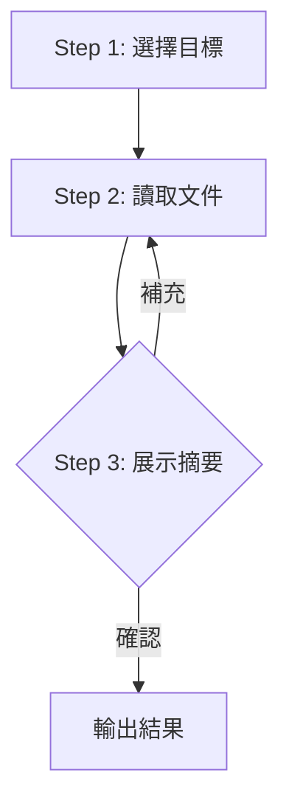

# Phase 1: 讀取

讀取並確認目標 Skill。

## Contract

```yaml
input:
  source: user
  type: text
  required: [Skill 名稱]

output:
  type: table
  schema:
    - name: Skill 名稱
    - files: 文件清單
    - lines: 行數統計

checkpoint: 用戶確認目標
```

## Workflow



---

## Step 1: 選擇目標 `[單選]`

掃描 `.claude/skills/` 目錄，列出可用 Skills：

<action>
AskUserQuestion({
  question: "要優化哪個 Skill？",
  header: "選擇 Skill",
  options: [
    { label: "{skill-1}", description: "根據掃描結果動態生成" },
    { label: "{skill-2}", description: "根據掃描結果動態生成" },
    { label: "{skill-3}", description: "根據掃描結果動態生成" }
  ],
  multiSelect: false
})
</action>

---

## Step 2: 讀取文件（處理）

讀取 Skill 的所有文件：
- SKILL.md
- references/*.md

---

## Step 3: 展示摘要 `[確認]`

```markdown
## {Skill Name} 結構摘要

- **Phases/Modes**: {N} 個
- **References**: {N} 個文件
- **SKILL.md 行數**: {N} 行

### 文件清單
- SKILL.md
- references/
  - {file1.md}
  - {file2.md}
```

<action>
AskUserQuestion({
  question: "以上摘要是否正確？",
  header: "摘要確認",
  options: [
    { label: "正確，開始檢查", description: "進入 Phase 2" },
    { label: "有遺漏文件", description: "補充其他文件" }
  ],
  multiSelect: false
})
</action>

### 回答後處理

| 選擇 | 處理 |
|------|------|
| 正確，開始檢查 | 記錄摘要 → 輸出結果 |
| 有遺漏文件 | 補充文件 → 更新摘要 → 重新確認 |
| Other（新內容）| 根據反饋調整 → 重新確認 |

---

## Output

```yaml
read:
  name: "{skill-name}"
  files:
    - path: "SKILL.md"
      lines: {n}
    - path: "references/{file}.md"
      lines: {n}
  total_lines: {n}
```
