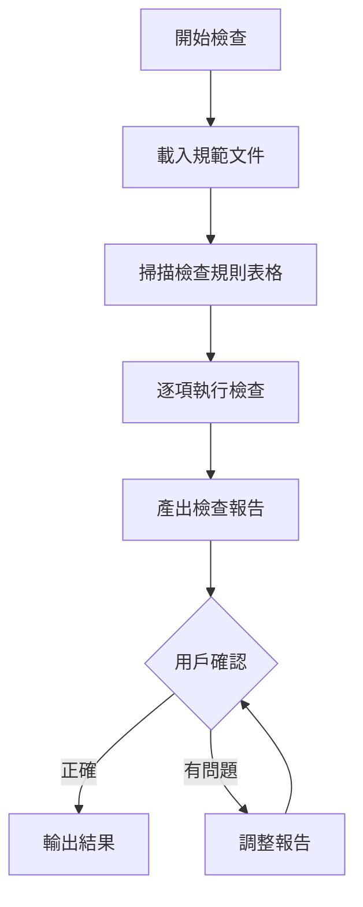

# Phase 2: 檢查

系統化檢查 Skill 是否符合所有規範。

## Contract

```yaml
input:
  source: phase-1
  type: yaml
  required: [name, type, files, skill_path]

output:
  type: table
  schema:
    - critical: 嚴重問題清單
    - warnings: 警告清單
    - passed: 通過項目
    - scope: 修正範圍

checkpoint: 用戶確認檢查結果
```

---

## Workflow



---

## Step 1: 載入規範文件（處理）

| 文件 | 適用範圍 |
|------|----------|
| [official-spec.md](official-spec.md) | 所有 Skill |
| [custom-spec.md](custom-spec.md) | 協作型 Skill |
| [general-spec.md](general-spec.md) | 所有 Skill |

**判斷協作型**：文件中有 `[單選]`、`[多選]`、`[確認]` 標記。

---

## Step 2: 執行檢查（處理）

掃描規範文件中所有「### 檢查規則」區塊，提取檢查項目表格，逐項執行檢查。

**檢查邏輯**：
1. 讀取規範文件
2. 找出所有「### 檢查規則」下的表格
3. 對每個檢查項目：
   - 根據「通過條件」檢查目標 Skill
   - 記錄通過/失敗狀態
   - 若失敗，記錄位置（檔案:行號）和嚴重度

**協作型判斷**：
- 若目標 Skill 是協作型 → 檢查所有規則
- 若目標 Skill 非協作型 → 跳過標記為「協作型」的規則

---

## Step 3: 產出檢查報告 `[確認]`

```markdown
## 檢查報告：{skill_name}

**Skill 類型**：{type}
**檢查項目**：{total} 項（{passed} 通過 / {failed} 失敗）

### 嚴重問題（Critical）

| # | 項目 | 位置 | 問題 |
|---|------|------|------|
| {id} | {項目} | {檔案:行號} | {描述} |

### 警告（Warning）

| # | 項目 | 位置 | 問題 |
|---|------|------|------|
| {id} | {項目} | {檔案:行號} | {描述} |

### 通過項目

- [x] {項目名稱}
...
```

<action>
AskUserQuestion({
  question: "檢查報告是否正確？",
  header: "報告確認",
  options: [
    { label: "正確，修正全部", description: "進入 Phase 3 修正所有問題" },
    { label: "只修正 Critical", description: "忽略 Warning" },
    { label: "有遺漏", description: "補充未列出的問題" },
    { label: "有誤判", description: "移除非問題項目" }
  ],
  multiSelect: false
})
</action>

### 回答後處理

| 選擇 | 處理 |
|------|------|
| 正確，修正全部 | scope = all → Phase 3 |
| 只修正 Critical | scope = critical_only → Phase 3 |
| 有遺漏 | 用戶補充 → 更新報告 → 重新確認 |
| 有誤判 | 用戶指出 → 移除項目 → 重新確認 |

---

## Output

```yaml
check:
  total: {n}
  passed: {n}
  critical:
    - id: "{項目編號}"
      item: "{項目名稱}"
      location: "{檔案:行號}"
      issue: "{問題描述}"
  warnings:
    - id: "{項目編號}"
      item: "{項目名稱}"
      location: "{檔案:行號}"
      issue: "{問題描述}"
  passed:
    - "{項目名稱}"
  scope: "all" | "critical_only"
```
