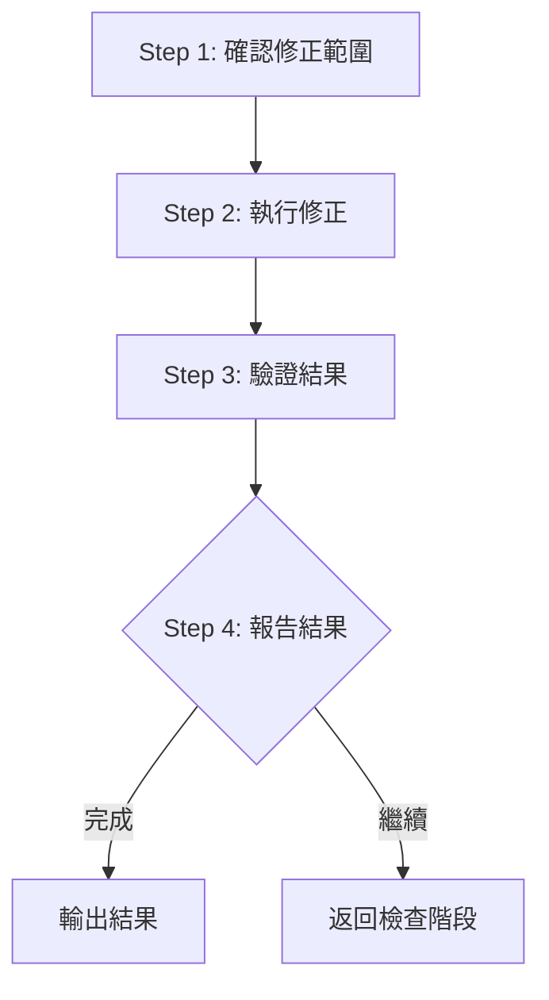

# Phase 3: 修正

執行修正並驗證結果。

## Contract

```yaml
input:
  source: phase-2
  type: yaml
  required: [critical, suggestions]

output:
  type: files
  schema: 更新後的 SKILL.md + references/*.md

checkpoint: 通過檢查清單
```

## Workflow



---

## Step 1: 確認修正範圍 `[單選]`

<action>
AskUserQuestion({
  question: "要執行哪些修正？",
  header: "修正範圍",
  options: [
    { label: "全部執行", description: "執行所有嚴重問題和建議" },
    { label: "僅嚴重問題", description: "只修正必要項目" },
    { label: "逐項確認", description: "一個一個確認" }
  ],
  multiSelect: false
})
</action>

---

## Step 2: 執行修正（處理）

常見修正：

| 問題類型 | 解決方案 |
|----------|----------|
| SKILL.md 過長 | 將詳細參考資料移到獨立文件 |
| 缺少 frontmatter | 添加 name 和 description |
| 缺少執行規則 | 添加 CRITICAL 規則區塊 |
| 流程圖無 Checkpoint | 添加 Checkpoint 節點 |
| 提問格式錯誤 | 改為 `<action>` 標籤格式 |
| Phase 缺少 Contract | 添加 Input/Output/Checkpoint 區塊 |

---

## Step 3: 驗證結果（處理）

重新執行規範檢查（依據規格文件中的檢查規則）。

---

## Step 4: 報告結果 `[確認]`

```markdown
## 優化報告

### 修改摘要
| 文件 | 修改類型 | 說明 |
|------|----------|------|
| SKILL.md | 修改 | {說明} |

### 驗證結果
- [x] 結構檢查：通過
- [x] 內容檢查：通過
- [x] 流程檢查：通過
- [x] 解耦檢查：通過
```

<action>
AskUserQuestion({
  question: "優化是否完成？",
  header: "完成確認",
  options: [
    { label: "確認完成", description: "結束優化" },
    { label: "繼續優化", description: "返回檢查階段" }
  ],
  multiSelect: false
})
</action>

### 回答後處理

| 選擇 | 處理 |
|------|------|
| 確認完成 | 記錄結果 → 輸出報告 |
| 繼續優化 | 返回檢查階段 |
| Other（新內容）| 根據反饋調整 → 重新驗證 |

---

## Output

```yaml
fix:
  changes:
    - file: "{檔案}"
      type: "{新增|修改|刪除}"
      description: "{說明}"
  validation:
    structure: passed
    content: passed
    flow: passed
    decoupling: passed
```
