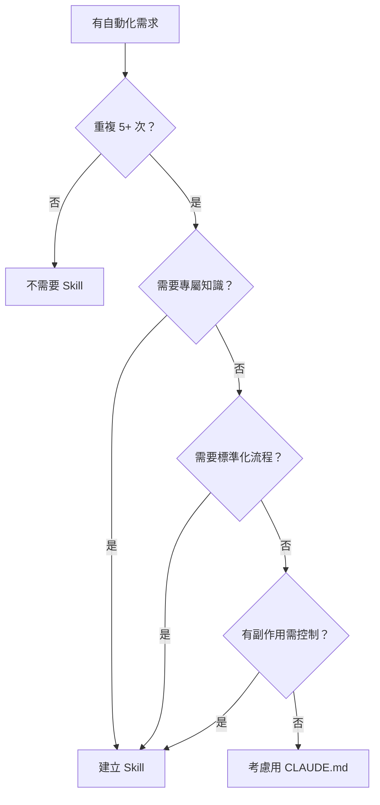

# Skill 類型模板

五種類型的 Skill 模板，可直接複製使用。

## 類型總覽

| 類型 | 用途 | 調用 | Frontmatter |
|------|------|------|-------------|
| 參考型 | 提供知識、規範 | 自動+手動 | 預設 |
| 任務型 | 執行特定操作 | 手動 | `disable-model-invocation: true` |
| 研究型 | 收集資訊、分析 | 自動+手動 | `context: fork`, `agent: Explore` |
| 協作型 | 多步驟互動 | 手動 | `disable-model-invocation: true` |
| 背景型 | 提供上下文 | 自動 | `user-invocable: false` |

---

## 參考型

提供 Claude 執行任務時需要遵循的知識或規範。

```markdown
---
name: {topic}-conventions
description: |
  {主題}規範。Use when {撰寫/設計/建立} {相關內容}。
---

# {主題}規範

## 核心原則

1. {原則 1}
2. {原則 2}

## 具體規則

### {類別 1}

- {規則}

## 範例

<good_example>
{好的範例}
</good_example>

<bad_example>
{不好的範例}
</bad_example>
```

---

## 任務型

執行有副作用的特定操作。

```markdown
---
name: {action}-{target}
description: |
  {做什麼}。Use when {觸發情境}。
argument-hint: [{參數說明}]
disable-model-invocation: true
allowed-tools: Bash(npm run *), Bash(git *)
---

# {任務名稱}

## 前置檢查

!`{檢查命令}`

## 執行步驟

1. **{步驟 1}**
   - {細節}

2. **{步驟 2}**
   - {細節}

## 驗證

- [ ] {驗證項目 1}
- [ ] {驗證項目 2}
```

---

## 研究型

收集資訊、分析程式碼，在獨立環境中執行。

```markdown
---
name: analyze-{target}
description: |
  分析 {目標}。Use when {分析情境}。
context: fork
agent: Explore
---

# {分析任務}

## 分析範圍

{描述要分析什麼}

## 分析步驟

1. **收集資訊**
   - {收集什麼}

2. **識別模式**
   - {找什麼 pattern}

3. **產出報告**
   - {報告格式}

## 輸出格式

### 摘要
{1-2 句話總結}

### 發現
- {發現項目}

### 建議
- {建議項目}
```

---

## 協作型

需要多步驟互動，收集用戶輸入後產出結果。

```markdown
---
name: {process}-{output}
description: |
  {做什麼}。Use when {觸發情境}。
disable-model-invocation: true
---

# {流程名稱}

## 流程

```mermaid
flowchart LR
    P1[Phase 1: {名稱}] --> C1{確認}
    C1 --> P2[Phase 2: {名稱}]
    P2 --> C2{確認}
    C2 --> P3[Phase 3: {名稱}]
    P3 --> DONE[完成]
```

## Phase 1: {收集階段}

### 需要資訊

1. {資訊 1}
2. {資訊 2}

### 確認點

展示收集到的資訊，請用戶確認。

## Phase 2: {處理階段}

### 處理步驟

1. {步驟}
2. {步驟}

### 確認點

展示處理結果，請用戶確認。

## Phase 3: {產出階段}

### 產出內容

{描述最終產出}
```

---

## 背景型

提供 Claude 需要知道但用戶不需要直接調用的上下文。

```markdown
---
name: {topic}-context
description: |
  {主題}背景資訊。Use when {相關情境}。
user-invocable: false
---

# {主題}背景

## 歷史脈絡

{為什麼會有這個情況}

## 當前狀態

{現在是什麼狀態}

## 注意事項

- {注意 1}
- {注意 2}

## 相關資源

- {連結或檔案}
```

---

## 何時建立 Skill



### 應該建立

- 重複性任務（5 次法則）
- Claude 不具備的專屬知識
- 需要標準化的多步驟流程
- 有副作用需要控制的操作

### 不應該建立

- 一次性任務
- Claude 已擅長的通用任務
- 過於簡單的操作
- 需要頻繁變更的內容
