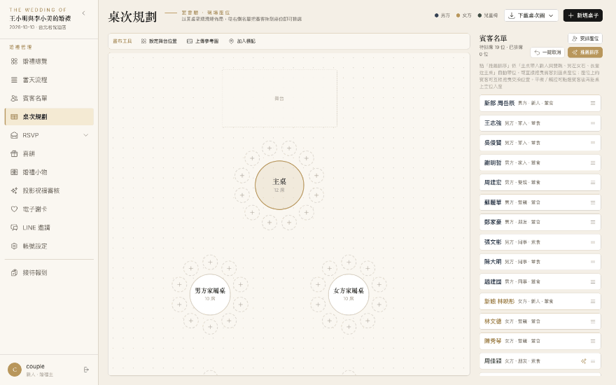
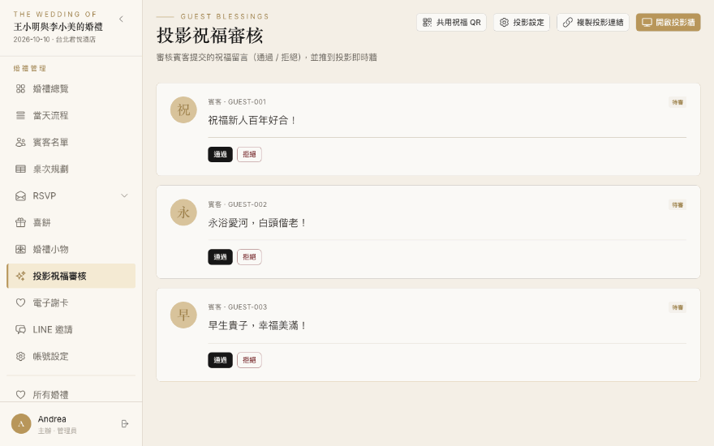
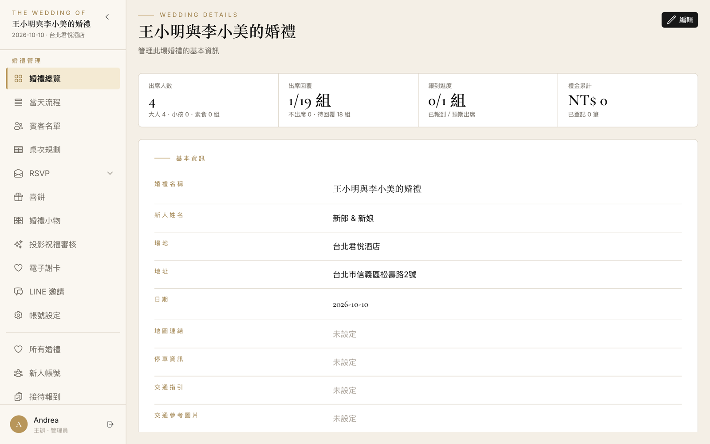
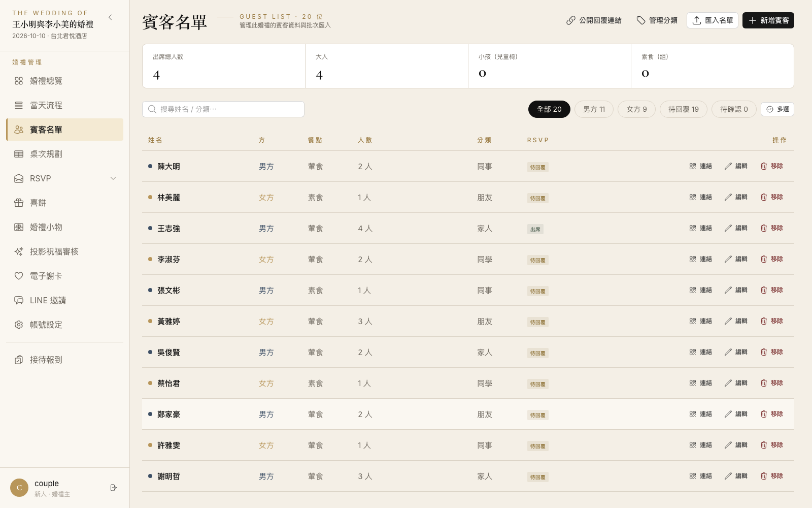
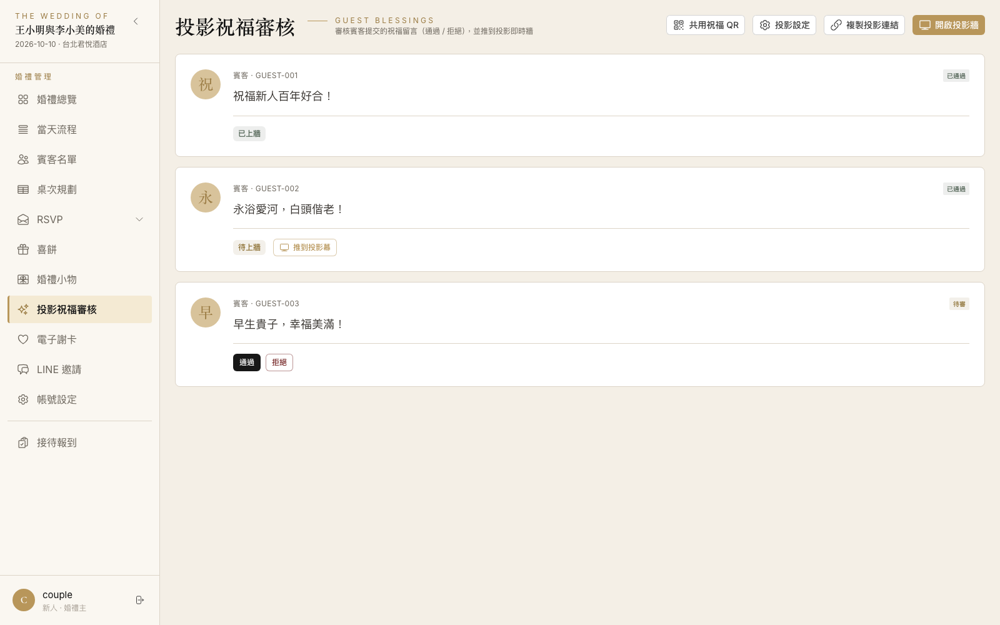
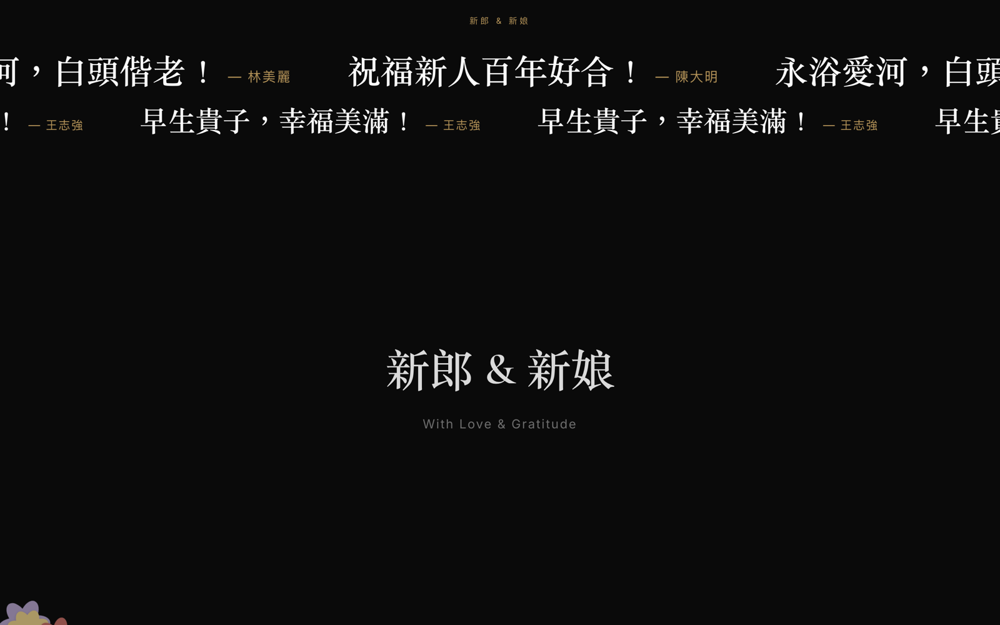
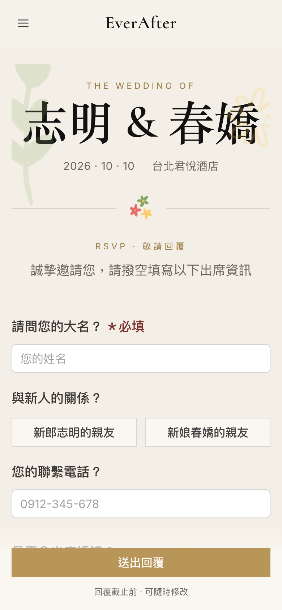

# EverAfter — 婚禮管理系統

> 一人 full-stack 打造的婚禮 SaaS：從籌備期的賓客名單、桌次排席、RSVP 邀請，到宴客當天的接待報到、祝福投影牆，再到婚後的謝卡群發——一站式管理。

**線上站**：<https://everafter-iota.vercel.app>（正式環境需登入；賓客頁由簽名連結進入）｜**想動手玩**：clone 後 `npm run dev` 零設定啟動完整系統（見[本機啟動](#本機啟動)）



*桌次規劃：以圓桌呈現現場佈局，賓客從名單拖曳入座；「推薦排序」依主桌帶入新人與雙親、男左女右、長輩近主桌的禮俗自動帶位。*

## 專案亮點

- **一人開發與維護的完整產品**：105 支 API、25 張資料表、11 個功能模組、4 種 UI 端，已部署上線（Vercel + Neon + Cloudflare R2）
- **規格驅動開發（SDD）**：程式碼由 Gherkin 業務規格逐層生成，E2E 測試是凍結合約——212 條 Playwright 測試（45 檔）守住業務不變量，UI 可以放心重構
- **賓客免登入體驗**：HMAC-SHA256 簽名連結（婚禮層級 / 賓客專屬兩種格式），賓客點連結即可回覆出席、寫祝福、看謝卡，無需帳號
- **零設定啟動**：所有外部依賴（DB、圖片儲存、LINE、監控）都有本機退路，`npm install && npm run dev` 就能跑起完整系統
- **雙模式授權**：`enforced`（正式環境，JWT + 簽名驗證）與 `open`（開發 / E2E，自動退回預設身分）同一套 middleware 切換，測試不必造假登入流程

## 操作演示

**賓客回喜帖**——免登入簽名連結進入，填寫出席資訊並親手畫一朵小花，種進新人的祝福花田：


**祝福審核與投影牆**——後台逐則通過賓客祝福，宴會現場投影牆即時以跑馬燈呈現：



## 產品導覽

| 後台總覽 | 賓客名單 |
|---|---|
|  |  |

| 祝福審核 | 投影牆（宴會現場即時跑馬燈） |
|---|---|
|  |  |

賓客側為行動優先的免登入公開頁：

| 喜帖 RSVP | 祝福花田 |
|---|---|
|  |  |

*每位賓客回覆喜帖時親手畫一朵花，慢慢種成整片花田——婚禮結束後成為新人的紀念。*

### 功能地圖

| 階段 | 功能 |
|------|------|
| 籌備 | 賓客名單（分類、批次匯入）、桌次排席（拖曳 + 禮俗檢查）、RSVP 表單設計與外觀客製、LINE 邀請與綁定 |
| 當天 | 接待報到台（獨立接待員帳號）、禮金登記、喜餅發放、祝福審核、投影牆即時跑馬燈 |
| 婚後 | 電子謝卡（範本 + 個別客製 + LINE multicast 群發）、祝福花田紀念頁 |
| 營運 | 多婚禮管理、角色權限（管理者 / 新人 / 接待員 / 賓客）、帳號管理 |

## 架構

Nuxt 4 單體：Vue 3 前端與 Nitro API 同一應用、同一次部署。`weddingId` 是全域分片鍵，同時是資料分區與授權邊界。

```
        管理者 / 新人 / 接待員                賓客（免登入，HMAC 簽名連結）
              │ JWT Bearer                        │ ?sig= → X-Guest-Sig
              ▼                                   ▼
┌─────────────────────────────────────────────────────────────────┐
│                     Nuxt 4 應用（Vercel SSR）                     │
│  app/（Vue 3 + NuxtUI）          server/（Nitro）                │
│  ├─ pages/    後台·接待·公開·投影  ├─ middleware/auth.ts  統一授權  │
│  ├─ api/      client API 包裝層   ├─ api/v1/**  route handler    │
│  ├─ types/api API 合約型別        └─ db/ Drizzle schema（25 表）  │
│  └─ stores/   auth（persisted）                                  │
└──────────┬──────────────┬──────────────┬──────────────┬─────────┘
           ▼              ▼              ▼              ▼
     PostgreSQL      Cloudflare R2    LINE 平台         Sentry
     （Neon／本機）   （presigned 直傳） （謝卡群發＋OAuth）（錯誤監控）
```

刻意的取捨（詳見 [docs/architecture.md](docs/architecture.md)）：

- **務實派 CRUD 而非分層架構**：route handler 直接操作 DB、普遍 20–50 行，橫切關注點（認證、授權）全數上移 middleware——一人專案把複雜度花在刀口上
- **型別即合約**：`app/types/api/` 是前後端共用的唯一合約來源，元件內禁止定義 local interface
- **賓客簽名不設過期**：謝卡等連結需婚後長期有效，要全面失效就輪換 secret

## 工程實踐

**SDD 流程**——程式碼由規格驅動生成，`spec/` 是上游真相：

```
spec/gherkin-feature/*.feature（業務規格）
        ↓ /feature-to-flow
spec/e2e-flows/*.flow.md（Business Invariants = 業務合約）
        ↓ /feature-to-api          ↓ /test e2e spec
app/types/api + server/api    test/e2e/specs/*.spec.ts（凍結）
        ↓ /feature-to-ui
app/pages（為通過 spec 而建）
```

**測試守門**：

- 主 spec（`test/e2e/specs/`）是凍結合約不得修改；vibe spec（`test/e2e/vibe/`）保護 UI 迭代
- pre-push hook 跑守門 config——Docker 可用時 build production image + ephemeral Postgres 全量驗證
- 紅燈依路徑分流：`specs/` 紅 = 破壞業務合約（修程式），`vibe/` 紅 = UI 改動需決策
- commitlint（Conventional Commits）+ ESLint + 自製視覺層級檢查（一頁一主焦點的設計規範，用腳本守住）

**GitHub 流程**：issue 綁 linked 分支（`feature/#N-描述`）→ PR 自動 `Closes #N` → Squash merge。

## 本機啟動

```bash
npm install
npm run dev   # 自動拉起 Docker Postgres、migrate + seed，零設定
```

啟動後以示範帳號 `couple`（密碼 `couple1122`）登入，即以「新人」視角操作含完整示範資料的婚禮。

環境需求：Node.js >= 22.12、Docker。環境變數清單見 [docs/architecture.md](docs/architecture.md) §8（全部可留空，未設定時自動退回本機相容行為）。

### 常用指令

| 指令 | 用途 |
|------|------|
| `npm run dev` | 啟動開發伺服器（含本機 DB） |
| `npm run build` / `npm run preview` | SSR 打包／預覽 |
| `npm run db:generate` / `db:migrate` / `db:studio` | Drizzle migration 與資料瀏覽 |
| `npm run db:create-admin` | 建立正式環境首位管理員 |
| `npm run eslint` / `npm run typelint` | Lint（含視覺層級檢查）／型別檢查 |
| `npm run test:unit` / `npm run test:e2e` | Vitest／Playwright 主 spec |
| `npx playwright test --config playwright.gate.config.ts` | 守門測試（主 spec + vibe spec） |

## 專案結構

```
app/                  # 前端（Vue 3 + NuxtUI）
├── api/              # per-domain client API 包裝層
├── components/       # 元件（common/ 為跨頁原子元件）
├── pages/            # 頁面路由（後台、公開頁、接待台、投影牆）
├── stores/           # Pinia store（僅 auth）
└── types/api/        # API 合約型別（型別即合約）
server/               # 後端（Nitro）
├── api/v1/           # route handler（務實派 CRUD）
├── db/               # Drizzle schema、migrations、seed
├── middleware/       # 統一認證授權
└── utils/            # JWT、賓客簽名連結、LINE、R2 等
spec/                 # SDD 規格（上游真相）
test/e2e/             # specs/（凍結合約）+ vibe/（UI 保護網）
```

## 技術棧

Nuxt 4（Vue 3 Composition API + NuxtUI 4 + Nitro）｜TypeScript strict｜Tailwind CSS 4｜PostgreSQL + Drizzle ORM｜Pinia｜Playwright + Vitest｜Vercel + Neon + Cloudflare R2 + LINE Messaging API + Sentry

## 文件

| 文件 | 內容 |
|------|------|
| [docs/architecture.md](docs/architecture.md) | 系統架構總覽（以程式碼為準） |
| [docs/ops.md](docs/ops.md) | 營運手冊：監控、密碼救援、故障排查 |
| [docs/production-readiness.md](docs/production-readiness.md) | 產品化評估與 roadmap |
| [doc/frontend/frontend-workflow.md](doc/frontend/frontend-workflow.md) | SDD 開發流程 |
